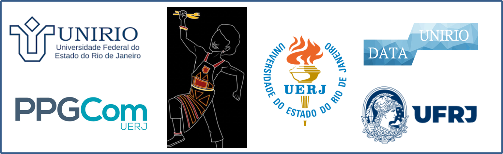

```{r setup, include=FALSE}
knitr::opts_chunk$set(echo = FALSE,message = FALSE, warning = FALSE,comment = NA)

options(digits = 2)
```

```{css, echo=FALSE}

@import url('https://fonts.googleapis.com/css?family=Roboto&display=swap');
  body {
    font-family: 'Roboto';
  }
  h3::first-letter {
    font-size: 150%;
    line-height: 70px;
    color: white;
    background-color: blue;
  }
  h1,h2,h4,h5,h6 {
     font-family: 'Roboto', cursive;
  }
  h3,h4,h5,h6 {
     font-family: 'Roboto', cursive;
     color: white;
     background-color: blue;
  }

  

```
  

```{r,out.width = "100%",fig.align='center'}

```


## Carga Horária: 06 Horas

## Coordenadores:  Fátima Regis (UERJ) e Breno Cruz (UFRJ)

## Professor: Steven Dutt-Ross  (Departamento de Métodos Quantitativos - DATAUNIRIO)

## Local: UERJ

## Dias: 12 e 19 de junho

## Horário: 14:30 às 17:00


# Plano de Ensino


### DESCRIÇÃO DO MINICURSO


Os métodos digitais trouxeram uma nova abordagem para os processos de pesquisa em Humanas e Ciências Sociais. Nesse minicurso, apresentaremos um dos principais novos métodos: **Análise de Texto** como dado não estruturado. Assim, vamos analisar de forma prática os textos por meio de uma abordagem quantitativa. Discutiremos as principais abordagens de análise de texto. Os(as) alunos(as) irão utilizar dados e informações reais e serão capazes de construir visualizações de dados, a partir de registros brutos, além de avaliarem as características desses textos para extrair insights úteis.      

### OBJETIVO

O objetivo central do curso é promover a capacidade de criar códigos para análise de texto utilizando a linguagem de programação R.


*** 

## Programação

**1. Termos e Conceitos - Dia 12/06/2023**

1.  Introdução ao texto como dado
2.  Conceitos Basicos: stopwords, corpus, token, lemma e stem
3.  Carregar dados no R (txt e RData)  
4.  Limpeza de texto
5.  Análise de palavras: Frequência e Nuvem   

***

**2. Aplicação no R - Dia 19/06/2023**  

1. Aplicação de Conceitos Basicos   
2. Análise de palavras: Bigrama e Trigrama
3. Análise de palavras: Tf-idf   

*** 


### Apresentação

**[Motivação](https://dataunirio.github.io/minicurso_analise_texto/apresentacao/motivacao)**  
  
**[Termos e Conceitos](https://dataunirio.github.io/minicurso_analise_texto/apresentacao/index)**


# Códigos 

[Codigo 1](https://raw.githubusercontent.com/DATAUNIRIO/minicurso_analise_texto/main/codigos/codigo_01.R)   

[Codigo 2](https://raw.githubusercontent.com/DATAUNIRIO/minicurso_analise_texto/main/codigos/codigo_02.R)

   
# Base de dados 

###  txt

[Dom Casmurro](https://raw.githubusercontent.com/DATAUNIRIO/minicurso_analise_texto/main/dados/txt/Dom_Casmurro.txt)

[Lisbon Revisited](https://raw.githubusercontent.com/DATAUNIRIO/minicurso_analise_texto/main/dados/txt/Fernando_Pessoa_Lisbon_Revisited.txt)
	
[Poema linha reta](https://raw.githubusercontent.com/DATAUNIRIO/minicurso_analise_texto/main/dados/txt/Fernando_Pessoa_Poema_linha_reta.txt)
	
[Guimarães](https://raw.githubusercontent.com/DATAUNIRIO/minicurso_analise_texto/main/dados/txt/obras_guimaraes.txt)

### RData

[Machado de Assis](https://github.com/DATAUNIRIO/minicurso_analise_texto/raw/main/dados/rdata/frases_dom_casmurro.RDATA)  
  
[Euclides da Cunha](https://github.com/DATAUNIRIO/minicurso_analise_texto/raw/main/dados/rdata/frases_sertoes.RDATA)   
[Guimarães Rosa](https://github.com/DATAUNIRIO/minicurso_analise_texto/raw/main/dados/rdata/frases_guimaraes_rosa.RData)  

[Paola Carosella](https://github.com/DATAUNIRIO/minicurso_analise_texto/raw/main/dados/rdata/Paola_Carosella.RData)  

***

### Bibliografia básica

SILGE, Julia; ROBINSON, David. Text mining with R: A tidy approach. " O'Reilly Media, Inc.", 2017. Disponível em [https://www.tidytextmining.com/index.html](https://www.tidytextmining.com/index.html)
  
ROSS, Steven Dutt; CRUZ, Breno de Paula Andrade. Análise quantitativa de textos: Apresentação e operacionalização da técnica via Twitter. Administração: Ensino e Pesquisa, v. 22, n. 1, 2021. Disponível em [https://raep.emnuvens.com.br/raep/article/view/1859/419](https://raep.emnuvens.com.br/raep/article/view/1859/419)


### Bibliografia complementar

1. SAMPAIO, Rafael Cardoso et al. Muito Bardin, pouca qualidade: uma avaliação sobre as análises de conteúdo qualitativas no Brasil. Revista Pesquisa Qualitativa, v. 10, n. 25, p. 464-494, 2022.

2. WICKHAM, H. and GROLEMUND, G.*R for data science: import, tidy, transform, visualize, and model data.*" O'Reilly Media, Inc.", 2016.


